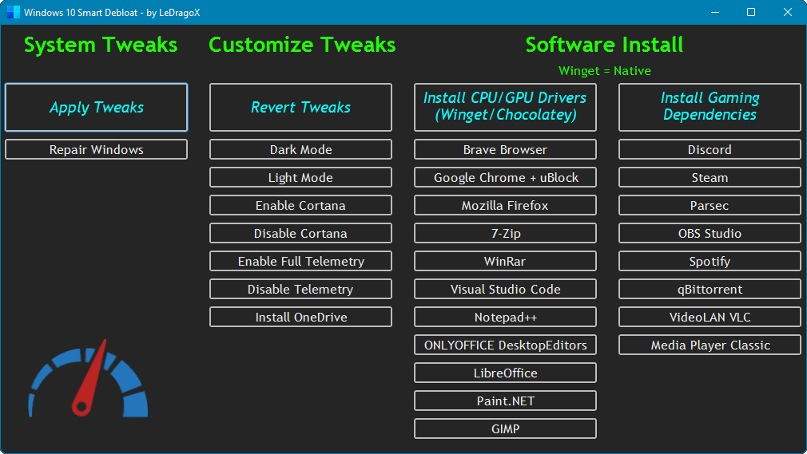

<h1 align="center">
     Win10 Smart Debloat 
    
</h1>

<h2 align="center">

Adapted from [W4RH4WK's Project](https://github.com/W4RH4WK/Debloat-Windows-10)

</h2>

## Download Latest Version

Code located in the `main` branch is always considered under development,
but you'll probably want the most recent version anyway.

<div align="center">

|                                                Download                                                 | Should work on |   Build    | Editions |                                        Powershell version                                         |
| :-----------------------------------------------------------------------------------------------------: | :------------: | :--------: | :------: | :-----------------------------------------------------------------------------------------------: |
| <h3><a href="https://github.com/LeDragoX/Win10SmartDebloat/archive/main.zip">🚀 Download [Zip]</a></h3> | 21H2 and Older | 22000.xxxx | Home/Pro |  v5.1 |

</div>

## Resume

This is an adapted version from [another project](https://github.com/W4RH4WK/Debloat-Windows-10).
These scripts will Customize, Debloat and Improve Security/Performance on Windows 10/Newer.

**Disclaimer:** _If something breaks, it's under your responsibility._

## Roll-Back

**There is a undo (if works)**, because i did a restoration point script before
doing everything.

**Use on a fresh windows install to note the differences, and if something breaks,**
**you can rely on a pre-made restoration point and the** [`repair-windows.ps1`](./src/scripts/repair-windows.ps1) file.

## Usage Requirements

The `Script-Win10.ps1` do not make everything automatically, follow these steps.

- Open `OpenPowershellHere.cmd` (For beginners) or the Powershell as admin on its folder.
- Enable execution of PowerShell scripts and Unblock PowerShell scripts and modules within this directory.

### **GUI Version**

- Copy and Paste this entire line below on **Powershell**:

```ps1
Set-ExecutionPolicy Unrestricted -Scope CurrentUser -Force; ls -Recurse *.ps*1 | Unblock-File; .\"Win10ScriptGUI.ps1"
```


_The `Apply Tweaks` button is the main one._

### **CLI Version** (Advice - If you want FULL Output to be displayed on the console, use this version)

- Copy and Paste this entire line below on **Powershell**:

```ps1
Set-ExecutionPolicy Unrestricted -Scope CurrentUser -Force; ls -Recurse *.ps*1 | Unblock-File; .\"Win10Script.ps1"
```

**[Scripts](./src/scripts) can be run individually, pick what you need.**

## GUI Script Features

<details>
    <summary>Click to expand</summary>

- `Apply Tweaks`: Run every 'non-interactive' Tweak scripts;
- `UI/UX Tweaks`: Run WinAero Tweaker to apply my profile and other "Manual" softwares in the future (maybe); ([`manual-debloat-softwares.ps1`](./src/scripts/manual-debloat-softwares.ps1))
- `Repair Windows`: Try to Completely fix the Windows worst problems via Command Line; ([`backup-system.ps1`](./src/scripts/backup-system.ps1) and ([`repair-windows.ps1`](./src/scripts/repair-windows.ps1))
- `Dark Mode & Light Mode`: Apply Dark Mode or Light Mode exclusively from GUI; ([Dark](./src/utils/dark-theme.reg) and [Light](./src/utils/light-theme.reg))
- `Install Softwares`: Install _Chocolatey/Winget_ and install basic Softwares from my selection. See [Document](./src/lib/docs/software-installer.md). ([`install-package-managers.ps1`](src/scripts/install-package-managers.ps1) and [`software-installer.ps1`](./src/scripts/software-installer.ps1))

</details>

## Common Script Features

<details>
    <summary>Click to expand</summary>

- Import all necessary Modules before Executing everything; ([lib folder](./src/lib/))
- Make a Restore Point and Backup the Hosts file; ([`backup-system.ps1`](./src/scripts/backup-system.ps1))
- Download OOShutUp10 and import all Recommended settings; ([`silent-debloat-softwares.ps1`](./src/scripts/silent-debloat-softwares.ps1))
- Download AdwCleaner and Run the latest version of for Virus/Adware scan;
- Disable Telemetry from Scheduled Tasks and Optimize it; ([`optimize-scheduled-tasks.ps1`](./src/scripts/optimize-scheduled-tasks.ps1))
- Re-Enable useful Services & Disable the Heavy ones; ([`optimize-services.ps1`](./src/scripts/optimize-services.ps1))
- Remove Bloatware Apps that comes with Windows 10, except from my choice; ([`remove-bloatware-apps.ps1`](./src/scripts/remove-bloatware-apps.ps1))
- Optimize Privacy and Performance settings via Registry and Powershell commands; ([`optimize-privacy-and-performance.ps1`](./src/scripts/optimize-privacy-and-performance.ps1))
- Apply General Personalization tweaks via Registry and Powershell commands; ([`personal-optimizations.ps1`](./src/scripts/personal-optimizations.ps1))
- Help improve the Security of Windows by a little; ([`optimize-security.ps1`](./src/scripts/optimize-security.ps1))
- Enable Optional Features especially for Gaming/Work (including WSL 2); ([`enable-optional-features.ps1`](./src/scripts/enable-optional-features.ps1))
- Remove OneDrive completely from the System, re-install is possible via Win Store; ([`remove-onedrive.ps1`](./src/scripts/remove-onedrive.ps1))
- Install _Chocolatey/Winget_ by default; ([`install-package-managers.ps1`](./src/scripts/install-package-managers.ps1))
- [Optional] Run WinAero Tweaker for Extra UI Customization and tell how to import my Profile; ([`manual-debloat-softwares.ps1`](./src/scripts/manual-debloat-softwares.ps1))
- [Optional] Try to Completely fix the Windows worst problems via Command Line; ([`repair-windows.ps1`](./src/scripts/repair-windows.ps1))
- In the End it Locks Script's Usage Permission. (`Win10Script(GUI).ps1`)

**\*Optional**: Means that you decide what to do.

</details>

## Known Issues

1. Start menu Search (`WSearch` indexing service will be disabled)
2. Sysprep will hang (Not Tested)
3. [~~Xbox Wireless Adapter~~](https://github.com/W4RH4WK/Debloat-Windows-10/issues/78) (Fixed by not disabling the `XboxGipSvc` service)
4. [Issues with Skype](https://github.com/W4RH4WK/Debloat-Windows-10/issues/79) (`Microsoft.SkypeApp` app will be uninstalled)
5. [Fingerprint Reader / Facial Detection not Working](https://github.com/W4RH4WK/Debloat-Windows-10/issues/189) (`WbioSrvc` service will be disabled)
6. Bluestacks doesn't work with Hyper-V enabled

### Solutions

<details>
    <summary>Click to expand</summary>
<p>Open PowerShell as admin and copy paste:</p>

### Solution 1

```Powershell
Get-Service WSearch | Set-Service -StartupType Automatic -PassThru | Start-Service
```

### Solution 5

```Powershell
Get-Service WbioSrvc | Set-Service -StartupType Automatic -PassThru | Start-Service
```

### Solution 6

```Powershell
Dism -Online -Disable-Feature -NoRestart -FeatureName:"Microsoft-Hyper-V-All"
Dism -Online -Disable-Feature -NoRestart -FeatureName:"HypervisorPlatform"
Dism -Online -Disable-Feature -NoRestart -FeatureName:"VirtualMachinePlatform"
```

</details>

## Contribute

I would be happy to extend the collection of scripts.
Just open an issue or send me a pull request. (Yes, if its useful, you can).

## Credits

- Special thanks to the [LowSpecGamer](https://youtu.be/IU5F01oOzQQ?t=324), he is the reason i've adapted this script.

- [W4RH4WK](https://github.com/W4RH4WK) (For his project ^^);
- [Sergey Tkachenko](https://winaero.com/) (_WinAero Tweaker Dev._);
- [O&O Software GmbH](https://www.oo-software.com/en/company) (_ShutUp10 Company_);
- [MalwareBytes](https://br.malwarebytes.com/company/) (_AdwCleaner Company_);
- [Adamx's channel](https://www.youtube.com/channel/UCjidjWX76LR1g5yx18NSrLA) - by [this video](https://youtu.be/hQSkPmZRCjc);
- [Baboo's channel](https://www.youtube.com/user/baboo) - by [this video](https://youtu.be/qWESrvP_uU8);
- [ChrisTitusTech](https://www.youtube.com/channel/UCg6gPGh8HU2U01vaFCAsvmQ) - gave me more confidence to mess with PowerShell after [this LIVE](https://youtu.be/ER27pGt5wH0)
- [Daniel Persson](https://www.youtube.com/channel/UCnG-TN23lswO6QbvWhMtxpA) - by [this video](https://youtu.be/EfrT_Bvgles);
- [matthewjberger](https://gist.github.com/matthewjberger) - by [this script](https://gist.github.com/matthewjberger/2f4295887d6cb5738fa34e597f457b7f).

## More Debloat Scripts (Community)

<details>
    <summary>Click to expand</summary>
<p>The scripts are designed to run With/Without (GUI/CLI) any user interaction. Modify them beforehand. If you want a more interactive approach check out:</p>

- [win10script](https://github.com/ChrisTitusTech/win10script) from [ChrisTitusTech](https://github.com/ChrisTitusTech) (Recommended);
- [Windows10Debloater](https://github.com/Sycnex/Windows10Debloater) from [Sycnex](https://github.com/Sycnex);
- [Windows 10 Sophia Script](https://github.com/farag2/Windows-10-Sophia-Script) from [farag2](https://github.com/farag2).
</details>

## How did i find specific Tweaks?

<details>
    <summary>Click to expand</summary>
<p>How To (Advanced Users)</p>

By using [SysInternal Suite](https://docs.microsoft.com/en-us/sysinternals/downloads/sysinternals-suite) `Procmon(64).exe`
i could track the `SystemSettings.exe` by filtering it per Process Name, then `Clearing the list (Ctrl + X)`
(But make sure it is `Capturing the Events (Ctrl + E)`) and finally, applying an option of the Windows Configurations
and searching the Registry Key inside `Procmon(64).exe`.


After finding the right register Key, you just need to Right-Click and select `Jump To... (Ctrl + J)` to get on its directory.


</details>

## License

Check the License file [here](LICENSE).
