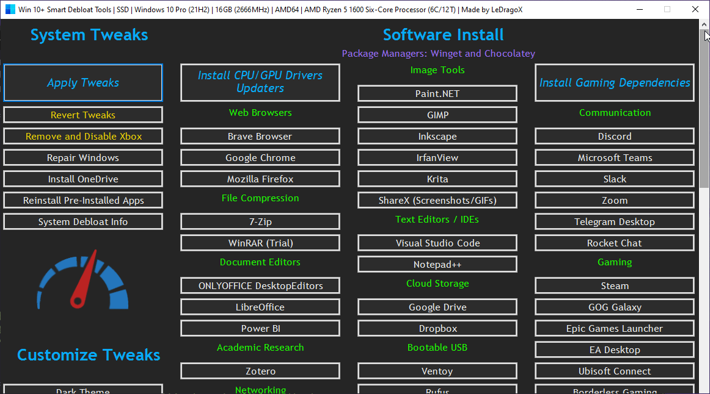
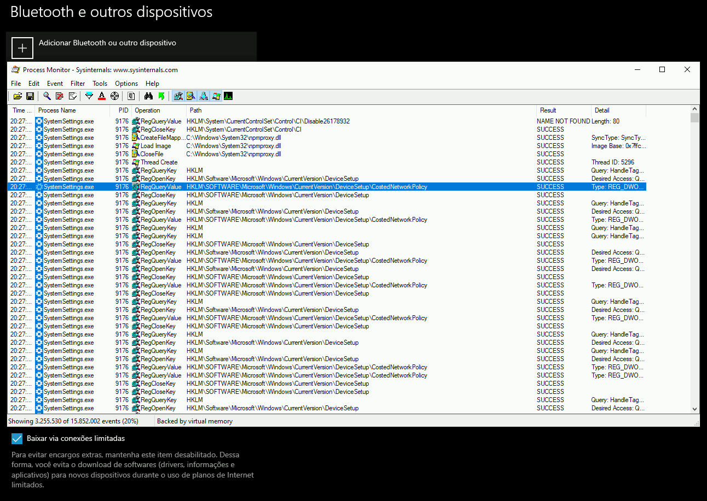
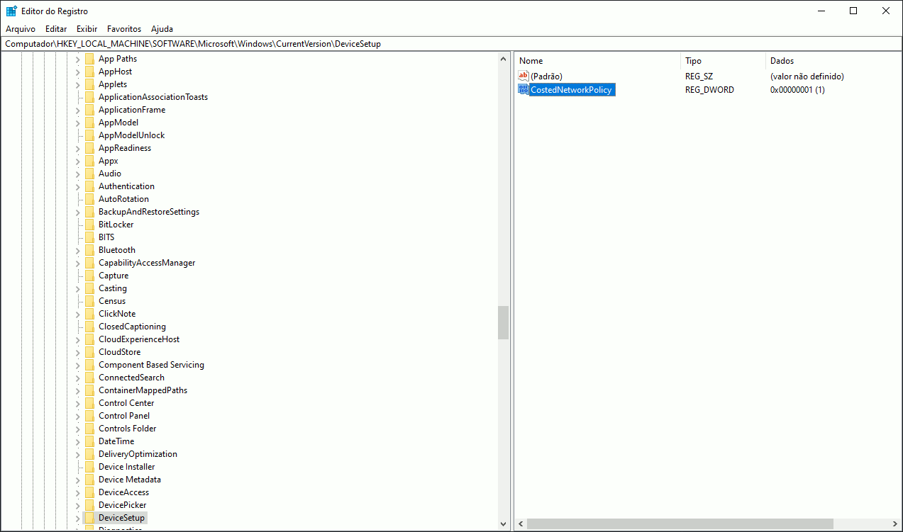

<h1 align="center">

[](https://github.com/LeDragoX/Win-10-Smart-Debloat-Tools/actions/workflows/powershell-linter.yml)


[](https://github.com/LeDragoX/Win-10-Smart-Debloat-Tools/commits/master)


</h1>

<h1 align="center">
  Win 10+ Smart Debloat Tools
 
</h1>

<h2 align="center">This Project was adapted from <a href="https://github.com/W4RH4WK/Debloat-Windows-10">W4RH4WK's Project</a></h2>

## 📄 Resume

These scripts will Customize, Debloat and Improve Privacy/Performance and System Responsiveness on Windows 10+.

> _Use on a fresh windows install to note the differences._

⚠️ **Disclaimer:** You're doing this at your own risk, I am not responsible for any data loss or damage that may occur.

## 🚀 Download Latest Version

Code located in the `main` branch is always considered under development,
but you'll probably want the most recent version anyway.

<div align="center">
 <table>
  <thead>
   <tr>
    <th>Download</th>
    <th>Version(s) Supported</th>
    <th>Edition(s)</th>
    <th>PowerShell Version</th>
   </tr>
  </thead>
  <tbody>
   <tr align="center">
    <td><h3><a href="https://github.com/LeDragoX/Win-10-Smart-Debloat-Tools/archive/main.zip">⬇️ Zip File ⬇️</a></h3></td>
    <td>21H2 or Older</td>
    <td>Home / Pro</td>
    <td> v5.1+</td>
   </tr>
  </tbody>
 </table>
</div>

## 🔄️ Roll-Back

**If something breaks you can rely on:**

1. A restoration point;
2. The [`repair-windows.ps1`](./src/scripts/repair-windows.ps1) file or button on [`Win10ScriptGUI.ps1`](./Win10ScriptGUI.ps1);
3. If you want (almost) everything to it's original state, use the `Undo Tweaks` button on [`Win10ScriptGUI.ps1`](./Win10ScriptGUI.ps1).

## ❗ Usage Requirements

The `Win10Script(CLI/GUI).ps1` do not make everything automatically, follow these steps.

- Extract the `.zip` file.
- Open `OpenTerminalHere.cmd` (For beginners) or the Powershell as admin on it's folder.
- Enable execution of PowerShell scripts and Unblock PowerShell scripts and modules within this directory (Down below).

### **GUI Version**

- Copy and Paste this entire line below on **Powershell**:

```ps1
Set-ExecutionPolicy Unrestricted -Scope CurrentUser -Force; ls -Recurse *.ps*1 | Unblock-File; .\"Win10ScriptGUI.ps1"
```



_The `Apply Tweaks` button is the main one for debloating._

### **CLI Version** (Minimal, good for automation)

- Copy and Paste this entire line below on **Powershell**:

```ps1
Set-ExecutionPolicy Unrestricted -Scope CurrentUser -Force; ls -Recurse *.ps*1 | Unblock-File; .\"Win10ScriptCLI.ps1"
```

**[Scripts](./src/scripts) can be run individually, pick what you need.**

## ✅ GUI Script Features

<details>
 <summary>Click to expand</summary>

### System Tweaks

- `Apply Tweaks`: Run every Common Tweak scripts;
- `Undo Tweaks`: Re-apply some tweaks and [Revert] all possible ones, covering the `Scheduled Tasks`, `Services`, `Privacy and Performance`, `Personal` and `Optional Features` tweaks, then try to `Reinstall Pre-Installed Apps`;
- `Remove and Disable Xbox`: Wipe Xbox Apps, disable Services related to Xbox and GameBar/GameDVR; ([`remove-and-disable-xbox.ps1`](./src/scripts/remove-and-disable-xbox.ps1))
- `Install OneDrive`: Tries to re-install the built-in OneDrive; ([`install-onedrive.ps1`](./src/utils/install-onedrive.ps1))
- `Reinstall Pre-Installed Apps`: Rebloat Windows with all the Pre-Installed Apps; ([`reinstall-pre-installed-apps.ps1`](./src/utils/reinstall-pre-installed-apps.ps1))
- `Repair Windows`: Try to Completely fix the Windows worst problems via Command Line; ([`backup-system.ps1`](./src/scripts/backup-system.ps1) and [`repair-windows.ps1`](./src/scripts/repair-windows.ps1))
- `Show Debloat Info`: Make an overall check-up from disabled and enabled Windows Components (Compare before and after applying tweaks, it's a great difference); ([`show-debloat-info.ps1`](./src/utils/show-debloat-info.ps1))

### Customize Tweaks (System Features)

- `Dark Theme & Light Theme`: Apply [Dark Theme](./src/utils/use-dark-theme.reg) or [Light Theme](./src/utils/use-light-theme.reg) on Windows;
- `Enable/Disable Activity History`: [Enables](./src/utils/enable-activity-history.reg) or [Disables](src/utils/disable-activity-history.reg) the **Activity History**;
- `Enable/Disable Background Apps`: [Enables](./src/utils/enable-bg-apps.reg) or [Disables](src/utils/disable-bg-apps.reg) _ALL_ the **Background Apps**;
- `Enable/Disable Cortana`: [Enables](./src/utils/enable-cortana.reg) or [Disables](src/utils/disable-cortana.reg) the **Cortana**;
- `Enable/Disable Clipboard History`: [Enables](./src/utils/enable-clipboard-history.reg) or [Disables](src/utils/disable-clipboard-history.reg) the **Clipboard History**;
- `Enable/Disable Old Volume Control`: [Enables](./src/utils/enable-old-volume-control.reg) or [Disables](src/utils/disable-old-volume-control.reg) the **Old Volume Control (Win 7/8.1)**;
- `Enable/Disable Search Indexing`: [Enables](./src/utils/enable-search-idx.ps1) or [Disables](src/utils/disable-search-idx.ps1) the **Windows Search Service**;
- `Enable/Disable Telemetry`: [Enables](./src/utils/enable-telemetry.reg) or [Disables](src/utils/disable-telemetry.reg) the **Windows Telemetry**;
- `Enable/Disable Xbox GameBar/DVR`: [Enables](./src/utils/enable-game-bar-dvr.reg) or [Disables](src/utils/disable-game-bar-dvr.reg) the **Xbox GameBar/DVR (In-Game)**;

### Customize Tweaks (Miscellaneous Features)

- `Enable/Disable God Mode`: [Enables](./src/utils/enable-god-mode.ps1) or [Disables](./src/utils/disable-god-mode.ps1) the hidden Desktop folder **God Mode**;
- `Enable/Disable Take Ownership menu`: [Enables](./src/utils/enable-take-ownership-context-menu.reg) or [Disables](src/utils/disable-take-ownership-context-menu.reg) the **Take Ownership context menu**;
- `Enable/Disable Shutdown PC shortcut`: [Enables](./src/utils/enable-shutdown-pc-shortcut.ps1) or [Disables](./src/utils/disable-shutdown-pc-shortcut.ps1) the **Shutdown Computer desktop shortcut**;

### Software Install

- `Install Gaming Dependencies`: Install all Gaming Dependencies required to play games (DirectX, VC++ 2005+ (x86 & x64), .NET Framework). ([`install-gaming-dependencies.ps1`](./src/scripts/install-gaming-dependencies.ps1));
- `Install Selected`: Install the selected apps by marking the checkbox(es);
- `Uninstall Mode`: Default as OFF, clicking this will switch the `Install Selected` button to `Uninstall Selected` and uninstall every selected apps (**Advice**: Blue colored buttons may not be able to uninstall completely and WSL UWP Apps, but WSL Distros will be unregistered);

</details>

## ☑️ Common Script Features

<details>
 <summary>Click to expand</summary>

- Import all necessary Modules before Executing everything; ([lib folder](./src/lib/))
- Logs both script versions on `C:\Users\Username\AppData\Local\Temp\Win10-SDT-Logs`;
- Make a Restore Point and Backup the Hosts file; ([`backup-system.ps1`](./src/scripts/backup-system.ps1))
- Install _Chocolatey/Winget_ by default; ([`install-package-managers.ps1`](./src/scripts/install-package-managers.ps1))
  - Auto-Update every available software via `Winget` (12:00/day) and `Chocolatey` (13:00/day);
  - Find the Scheduled Job on `Task Scheduler > "Microsoft\Windows\PowerShell\ScheduledJobs\Chocolatey/Winget Daily Upgrade"`;
  - Register daily upgrade logs on `C:\Users\Username\AppData\Local\Temp\Win10-SDT-Logs` and remove old log files;
- Download AdwCleaner and Run the latest version of for Virus/Adware scan; ([`silent-debloat-softwares.ps1`](./src/scripts/silent-debloat-softwares.ps1))
- Download OOShutUp10 and import all Recommended settings;
- Disable Telemetry from Scheduled Tasks and Optimize it; ([`optimize-scheduled-tasks.ps1`](./src/scripts/optimize-scheduled-tasks.ps1))
- Disable heavy Services, but enable some on SSDs for optimum performance; ([`optimize-services.ps1`](./src/scripts/optimize-services.ps1))
- Remove Bloatware UWP Apps that comes with Windows 10+, except from my choice; ([`remove-bloatware-apps.ps1`](./src/scripts/remove-bloatware-apps.ps1))
- Optimize Privacy by disabling more telemetry stuff and changing GPOs; ([`optimize-privacy.ps1`](./src/scripts/optimize-privacy.ps1))
- Optimize Performance by changing away from stock configurations that slowdowns the system; ([`optimize-performance.ps1`](./src/scripts/optimize-performance.ps1))
- Apply General Personalization tweaks via Registry and Powershell commands; ([`personal-tweaks.ps1`](./src/scripts/personal-tweaks.ps1))
- Help improve the Security of Windows while maintaining performance; ([`optimize-security.ps1`](./src/scripts/optimize-security.ps1))
- Remove OneDrive completely from the System, re-install is possible via Win Store; ([`remove-onedrive.ps1`](./src/scripts/remove-onedrive.ps1))
- Disable/Enable Windows Features specially for Gaming/Productivity; ([`optimize-windows-features.ps1`](./src/scripts/optimize-windows-features.ps1))
- In the End it only locks Local Machine script execution. ([`set-script-policy.psm1`](./src/lib/set-script-policy.psm1))

</details>

## ⚡ Troubleshooting Known Issues

> For each issue, expand the issue you're looking for,
> and Open PowerShell as admin to copy + paste it's content:

<details>
 <summary>Bring back Taskbar <code>Widgets</code> (Windows 11) - See <a href="https://github.com/LeDragoX/Win-10-Smart-Debloat-Tools/issues/7">#7</a></summary>

1. Press `Win + R` then paste this protocol: `ms-windows-store://pdp/?ProductId=9MSSGKG348SP`
2. Then click `Get`/`Install`
3. After this, open the `Taskbar Settings` and enable the `Widgets` button again

</details>

<details>
 <summary>Fix <code>NVIDIA Control Panel</code></summary>

> Only this time (Recommended - Consumes less RAM after boot)

```Powershell
Get-Service "NVDisplay.ContainerLocalSystem" | Set-Service -StartupType Manual -PassThru | Start-Service
```

> Permanently (Keeps the service running along with the system)

```Powershell
Get-Service "NVDisplay.ContainerLocalSystem" | Set-Service -StartupType Automatic -PassThru | Start-Service
```

</details>

<details>
 <summary>Sysprep will hang (Not Tested).</summary>

> _No solution yet, do a Google search_

</details>

## ➕ Contribute

I would be happy to extend the collection of scripts.
Just open an issue or send me a pull request. (Yes, if it's useful, you can).

> TIP: To clone quickly, use this command:

```sh
git clone --filter=tree:0 https://github.com/LeDragoX/Win-10-Smart-Debloat-Tools.git
```

## 🤍 Credits

- Special thanks to the [LowSpecGamer](https://youtu.be/IU5F01oOzQQ?t=324), he is the reason i've adapted this script.

- [W4RH4WK](https://github.com/W4RH4WK) (For his project ^^);
- [O&O Software GmbH](https://www.oo-software.com/en/company) (_ShutUp10 Company_);
- [MalwareBytes](https://br.malwarebytes.com/company/) (_AdwCleaner Company_);
- [Adamx's](https://www.youtube.com/channel/UCjidjWX76LR1g5yx18NSrLA) - by [_this video_](https://youtu.be/hQSkPmZRCjc) (and script);
- [Baboo's](https://www.youtube.com/user/baboo) - by [_this video_](https://youtu.be/qWESrvP_uU8) (and commands);
- [ChrisTitusTech](https://www.youtube.com/channel/UCg6gPGh8HU2U01vaFCAsvmQ) - gave me more confidence to mess with PowerShell after [_this 🔴 LIVE_](https://youtu.be/ER27pGt5wH0)
- [Daniel Persson](https://www.youtube.com/channel/UCnG-TN23lswO6QbvWhMtxpA) - by [_this video_](https://youtu.be/EfrT_Bvgles) (and script explanation);
- [matthewjberger](https://gist.github.com/matthewjberger) - by [_this script_](https://gist.github.com/matthewjberger/2f4295887d6cb5738fa34e597f457b7f).

## 🔧 Tweak Testers

- All of _my friends and people_ who trusted on me to run the script;
- [yCr-shiddy](https://github.com/yCr-shiddy) - Helped giving more ideas and fixes;

## 🏅 More Debloat Scripts (Community)

<details>
    <summary>Click to expand</summary>
<p>The scripts are designed to run With/Without (GUI/CLI) any user interaction. Modify them beforehand. If you want a more interactive approach check out:</p>

- [win10script](https://github.com/ChrisTitusTech/win10script) and [winutils](https://github.com/ChrisTitusTech/winutil) (Recommended) from [ChrisTitusTech](https://github.com/ChrisTitusTech);
- [Windows10Debloater](https://github.com/Sycnex/Windows10Debloater) from [Sycnex](https://github.com/Sycnex);
- [Sophia-Script-for-Windows](https://github.com/farag2/Sophia-Script-for-Windows) from [farag2](https://github.com/farag2);
- [Windows-Optimize-Harden-Debloat](https://github.com/simeononsecurity/Windows-Optimize-Harden-Debloat) and [Windows-Optimize-Debloat](https://github.com/simeononsecurity/Windows-Optimize-Debloat) from [SimeonOnSecurity](https://github.com/simeononsecurity);

</details>

## 🔎 How did i find specific Tweaks?

<details>
 <summary>Click to expand</summary>
 <p>How To (Advanced Users)</p>

By using [SysInternal Suite](https://docs.microsoft.com/en-us/sysinternals/downloads/sysinternals-suite) `Procmon(64).exe` i could track the `SystemSettings.exe` by filtering per Process Name `(Ctrl + L)`.

- But, not every time filtering the application you want will show the registry tweaks that were applied, so make sure other processes appear.
- Then use `Clearing the list (Ctrl + X)` (But make sure it is `Capturing the Events (Ctrl + E)`) and finally, applying an option of the Windows Configurations
  and searching the Registry Key inside `Procmon(64).exe`.
- Also make sure to disable the Events being captured `(Ctrl + E)` after applying a specific config.



After finding the right register Key, you just need to Right-Click and select `Jump To... (Ctrl + J)` to get on it's directory.



</details>

## 📝 License

Licensed under the [MIT](LICENSE.txt) license.
