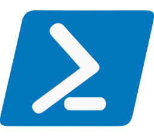
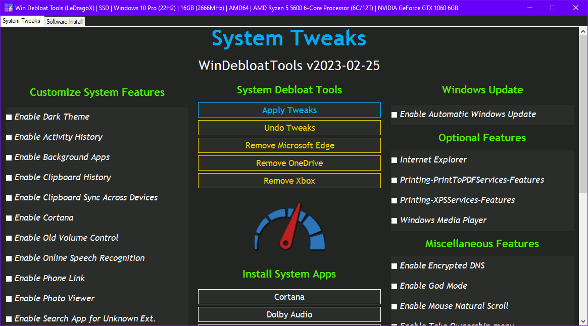

<!--
Self reminder: If i'm willing to change the repository name (again...why???)
I need to change these files:
- src\lib\start-logging.psm1
- src\lib\title-templates.psm1 (LOGO)
- CONTRIBUTING.md
- README.md
- WinDebloatTools.ps1 (Window Title)
-->

<h2 align="center">


[](https://github.com/LeDragoX/Win-Debloat-Tools/actions/workflows/powershell.yaml)


[](https://github.com/LeDragoX/Win-Debloat-Tools/commits/master)


<i>
  This Project was adapted from <a href="https://github.com/W4RH4WK/Debloat-Windows-10">W4RH4WK's Project</a>
</i>
</h2>

***Re-imagining Windows like a minimal OS install, already debloated with minimal impact for most functionality.***

> [!WARNING]
> **DISCLAIMER:** *You're doing this at your own risk, I am not responsible for any data loss or damage that may occur. It's not guaranteed that every feature removed from the system can be easily restored.*

## 🚀 Download Latest Version

Code located in the `main` branch is considered bleeding-edge, but big features/reworks will be implemented in a separate branch.

> [!IMPORTANT]
> *Use on a fresh Windows install to notice the differences. Using an admin account is recommended to avoid any compatibility issues.*

<div align="center">
  <table>
    <thead align="center">
      <tr>
        <th>Branch to Download</th>
        <th>Version(s) Supported</th>
        <th>Edition(s)</th>
        <th>Architecture</th>
        <th>PowerShell Version</th>
      </tr>
    </thead>
    <tbody align="center">
      <tr>
        <td>
            <h4><a href="https://github.com/LeDragoX/Win-Debloat-Tools/archive/main.zip">⬇️ Main</a></h4>(Current)
        </td>
        <td rowspan="2">23H2 or Older</td>
        <td rowspan="2">Home / Pro</td>
        <td rowspan="2">
          x86/x64 ONLY<br>
          ARM/ARM64 will break your installation (<a href="https://github.com/LeDragoX/Win-Debloat-Tools/issues/97">#97</a>)
        </td>
        <td rowspan="2"> v5.1+</td>
      </tr>
    </tbody>
  </table>
</div>

## ✨ Usage

**To run a variant of the script, follow these steps:**

- Extract the **entire** `.zip` file to another folder.
- Run `OpenTerminalHere.cmd` (try to `run as admin` if nothing happens at all).
- Copy and Paste one of the lines below on your **Terminal** to unblock the scripts and execute it:

### GUI Version

```ps1
Set-ExecutionPolicy Unrestricted -Scope CurrentUser -Force; ls -Recurse *.ps*1 | Unblock-File; .\"WinDebloatTools.ps1"
```

<div align="center">


*The `Apply Tweaks` button is the main one for debloating.*

</div>

### **CLI Version** (Straight to debloat)

```ps1
Set-ExecutionPolicy Unrestricted -Scope CurrentUser -Force; ls -Recurse *.ps*1 | Unblock-File; .\"WinDebloatTools.ps1" 'CLI'
```

**[Scripts](./src/scripts) can be run individually, pick what you need.**

## 🔄️ Roll-Back

**If something breaks you can rely on:**

1. If you want **(almost)** everything to it's original state, use the `Undo Tweaks` button on [`WinDebloatTools.ps1`](./WinDebloatTools.ps1).
2. A restoration point done by the script itself;
3. The `Repair Windows` button on [`WinDebloatTools.ps1`](./WinDebloatTools.ps1);

## ☑️ Common Script Features

<details>
  <summary>Click to expand</summary>

**This part is also valid to the *Apply Tweaks* button on the GUI.**

- Import all necessary *modules* before executing everything ([Source](./src/lib/));
- Logs both script runs on `C:\Users\<<USERNAME>>\AppData\Local\Temp\Win-DT-Logs`;
- Make a Restore Point and Backup the Hosts file ([Source](./src/scripts/Backup-System.ps1));
- Download AdwCleaner and Run the latest version for *Virus/Adware* scan and from OOShutUp10 and import all Recommended settings from a file ([Source](./src/scripts/Invoke-DebloatSoftware.ps1));
- Disable *non-essential* **Telemetry** from **Scheduled Tasks** and Optimize it ([Source](./src/scripts/Optimize-TaskScheduler.ps1));
- Disable *heavy* **Services**, but enable some on SSDs for optimum performance ([Source](./src/scripts/Optimize-ServicesRunning.ps1));
- Remove some of the legacy system components called as "**Capabilities**", except the most popular ones ([Source](./src/scripts/Remove-CapabilitiesList.ps1));
- Remove **Bloatware UWP Apps** that comes with Windows 10+, except from my choice ([Source](./src/scripts/Remove-BloatwareAppsList.ps1));
- Optimize **Privacy** by disabling more **telemetry** parts and changing **GPOs**, all through changing **registry keys** ([Source](./src/scripts/Optimize-Privacy.ps1));
- Optimize **Performance** by changing away from default settings that slowdowns the system, utilizing **PowerShell commands** and **changing registries** to disable features ([Source](./src/scripts/Optimize-Performance.ps1));
- Apply **Personalization** tweaks on **UI** and **System Settings** via **Registry** and **PowerShell** commands ([Source](./src/scripts/Register-PersonalTweaksList.ps1));
- Help improve the **Security** of Windows while maintaining performance ([Source](./src/scripts/Optimize-Security.ps1));
- Disable **obsolete** Windows **optional features** and enable some that might help ([Source](./src/scripts/Optimize-WindowsFeaturesList.ps1));

</details>

## ✅ GUI Script Features

<details>
  <summary>Click to expand</summary>

### System Tweaks

#### Customize System Features ([Can be found here](src/utils/Individual-Tweaks.psm1))

- `Enable/Disable Dark Theme`: Apply *Dark Theme* or *Light Theme* on Windows;
- `Enable/Disable Activity History`: Manages the **Activity History** setting;
- `Enable/Disable Background Apps`: Manages *ALL* the **Background Apps** settings;
- `Enable/Disable Clipboard History`: Manages the **Clipboard History** setting, that keeps a history from your clipboard pressing `Windows + V` key;
- `Enable/Disable Clipboard Sync Across Devices`: Manages the **Clipboard Sync Across Devices** setting, which allows to use the same clipboard for multiple devices (must be using a MS account);
- `Enable/Disable Cortana`: Manages the **Cortana** setting;
- `Enable/Disable Hibernate`: Manages the **Hibernate** setting;
- `Enable/Disable Legacy Context Menu`: Bring back the Windows 10 **context menu** from right-clicking or default on Windows 11;
- `Enable/Disable Location Tracking`: Allow or block **location sensors and trackers** on Windows;
- `Enable/Disable News And Interest`: Show or hide the **temperature and climate** on the taskbar;
- `Enable/Disable Old Volume Control`: Manages the **Old Volume Control (Win 7/8.1)** setting;
- `Enable/Disable Online Speech Recognition`: Manages the **Online Speech Recognition** setting, by pressing the keys `Windows + H` you can speak through your mic, then use it to type text using your voice;
- `Enable/Disable Phone Link`: Manages the **Phone Link** setting, which can link your Android/iPhone devices notifications to Windows;
- `Enable/Disable Photo Viewer`: [*Enables*](./src/utils/enable-photo-viewer.reg) or [*Disables*](src/utils/disable-photo-viewer.reg) the old **Photo Viewer (Win 7/8.1)**;
- `Enable/Disable Search App for Unknown Ext.`: When running a unknown extension file, be able to search through **MS Store** for an App that can open it.
- `Enable/Disable Telemetry`: Manages the **Windows Telemetry Level** setting;
- `Enable/Disable WSearch Service`: Manages the **Windows Search Service** setting;
- `Enable/Disable Windows Spotlight`: Manages the spotlight setting in personalization settings, giving a new desktop and lockscreen wallpaper daily;
- `Enable/Disable Xbox Game Bar/DVR/Mode`: Manages the **Xbox Game Bar/DVR/Mode** setting, that can open Game Bar anywhere, record clips from games and change Game Mode;

#### System Debloat Tools

- `Apply Tweaks`: Run every Common Tweak scripts ([Go To **☑️ Common Script Features** section](#%EF%B8%8F-common-script-features));
- `Undo Tweaks`: Re-apply some tweaks and *Revert* all possible ones, covering the, `ShutUp10 settings`, `Scheduled Tasks`, `Services`, `Privacy and Performance`, `Personal` and `Optional Features` tweaks, then try to `Reinstall Pre-Installed Apps`;
- [`Remove Microsoft Edge`](./src/scripts/Remove-MSEdge.ps1): uninstalls **Microsoft Edge**, disables Scheduled Tasks and Services related to Edge, then remove the remaining files, **Edge Web View** files will remain untouched, but apps which depends on **WebView2** will not install unless you install Microsoft Edge;
- [`Remove OneDrive`](./src/scripts/Remove-OneDrive.ps1): completely removes OneDrive from the System, re-install is possible via Win Store;
- [`Remove Xbox`](./src/scripts/Remove-Xbox.ps1): wipe Xbox Apps, disable Services related to Xbox and GameBar/GameDVR;

#### Install System Apps ([Can be found here](src/utils/Install-Individual-System-Apps.psm1))

*This section contains options to restore the system apps, by downloading them from the **MS Store** (mostly) and doing **Stock configurations** (for some Apps).*

> The Xbox button uses a script to restore functionalities and reinstall the Xbox Apps available on MS Store.

#### Other Tools

*This section contains tools to solve some Windows problems and get info about how much debloated the system is.*

- [`Randomize System Color`](./src/scripts/other-scripts/New-SystemColor.ps1): Changes the Windows color pallette to a random generated hex color;
- [`Reinstall Pre-Installed Apps`](./src/scripts/Install-DefaultAppsList.ps1): Rebloat Windows with all the Pre-Installed Apps;
- [`Repair Windows`](./src/scripts/Repair-WindowsSystem.ps1): Try to Completely fix the Windows worst problems via Command Line;
- [`Show Debloat Info`](./src/scripts/other-scripts/Show-DebloatInfo.ps1): Make an overall check-up from disabled and enabled Windows Components (Compare before and after applying tweaks, it's a great difference);

#### Windows Update ([Can be found here](src/utils/Individual-Tweaks.psm1))

- `Enable/Disable Automatic Windows Update`: Set Windows updates to automatic or manual;

#### Optional Features/Task Scheduler/Services/Windows Capabilities ([Can be found here](src/utils/Individual-Tweaks.psm1))

*These sections can manually adjust **Features** from the system, working as a ON/OFF toggle.*

#### Miscellaneous Features ([Can be found here](src/utils/Individual-Tweaks.psm1))

- `Enable/Disable Encrypted DNS`: Sets the DNS Client Servers to **Cloudflare's** and **Google's** (ipv4 and ipv6), and enables **DNS Over HTTPS** on *Windows 11*.
- `Enable/Disable God Mode`: Manages the hidden Desktop folder called "**God Mode**";
- `Enable/Disable Mouse Acceleration`: Manages the **Enhance Pointer Precision** setting from mouse settings;
- `Enable/Disable Mouse Natural Scroll`: Sets the mac-like mouse scrolling behavior, basically reverts mouse scroll direction;
- `Enable/Disable Take Ownership menu`: [*Enables*](./src/utils/enable-take-ownership-context-menu.reg) or [*Disables*](src/utils/disable-take-ownership-context-menu.reg) the **Take Ownership context menu**;
- `Enable/Disable Shutdown PC shortcut`: Manages the **Shutdown Computer desktop shortcut**;

### Software Install

- [Install *Winget/Chocolatey* package managers](./src/lib/package-managers/);

  - Be able to install the listed software in this script! Even from System apps.
  - **Importante Note:** When proceeding to install a new app, the script will automatically install the required package manager for that operation.

- [**Create** or **Remove** a Daily Upgrade Task for *Winget/Chocolatey* packages](./src/lib/package-managers/);

  - Creates a new Scheduled Job to daily upgrade all available softwares via *Winget* at **12:00** and *Chocolatey* at **13:00**;
  - Register daily upgrade logs on `C:\Users\<<USERNAME>>\AppData\Local\Temp\Win-DT-Logs` and remove old log files;

- `Remove All Chocolatey Packages`: List all packages from Chocolatey which are installed and remove everything at once;

- `Upgrade All Softwares`: Upgrades all Softwares installed on your machine installed through *Winget* and *Chocolatey*.
  - WSL will only update itself, not the distros installed.
- `Install Selected`: Install the selected apps by marking the checkbox(es);
- `Uninstall Mode`: Default as OFF, clicking this will switch the `Install Selected` button to `Uninstall Selected` and uninstall every selected apps (**Advice:** differently colored buttons may not be able to uninstall completely and WSL UWP Apps, but WSL Distros will be unregistered);

</details>

## ➕ Contributing

FIRST of all, if have any *questions* or *concerns* about the project, please refer to the [DISCUSSION](https://github.com/LeDragoX/Win-Debloat-Tools/discussions/new/choose) page, not the **ISSUES**, this helps keeping the project organized, thanks!
Found a *bug* or want a *new feature*? You can open a new `Issue` [here](https://github.com/LeDragoX/Win-Debloat-Tools/issues/new/choose).
Wanting to add *improvements* or *fixes*? Please check out the [CONTRIBUTING.md](CONTRIBUTING.md) file.

## 🤍 Credits

- Special thanks to [LowSpecGamer](https://youtu.be/IU5F01oOzQQ?t=324), he is the reason i've adapted this script.
- Special thanks to [Fabio Akita](https://youtu.be/sjrW74Hx5Po?t=318), for believing in this project and making this script famous 🤍.
- [W4RH4WK](https://github.com/W4RH4WK) - For his project ^^
- [Tester] All of *my friends and people* who trusted on me to run the script;
- [Tester] [yCr-shiddy](https://github.com/yCr-shiddy) - Helped giving more ideas and fixes;
- [Code] [Adamx's](https://www.youtube.com/channel/UCjidjWX76LR1g5yx18NSrLA) - by [*this video*](https://youtu.be/hQSkPmZRCjc) (and script);
- [Code] [Baboo's](https://www.youtube.com/user/baboo) - by [*this video*](https://youtu.be/qWESrvP_uU8) (and commands);
- [Code] [ChrisTitusTech](https://www.youtube.com/channel/UCg6gPGh8HU2U01vaFCAsvmQ) - by having taught how to mess with *PowerShell* in [this Stream](https://youtu.be/ER27pGt5wH0) (and his *open-source* debloat script);
- [Code] [Daniel Persson](https://www.youtube.com/channel/UCnG-TN23lswO6QbvWhMtxpA) - by [*this video*](https://youtu.be/EfrT_Bvgles) (and script explanation);
- [Code] [matthewjberger](https://gist.github.com/matthewjberger) - by [*this script*](https://gist.github.com/matthewjberger/2f4295887d6cb5738fa34e597f457b7f).

## 🛣️ Roadmap

List of all changes made on the script since the beginning, the file can be accessed [here](ROADMAP.md).

## 🏅 Recommended Alternative

The scripts are designed to run without any user interaction. Modify them beforehand. If you want a more interactive approach (also more maintained) then check out:

- [winutil](https://github.com/ChrisTitusTech/winutil) from [ChrisTitusTech](https://github.com/ChrisTitusTech);

## 📝 Legal / License

*This project is NOT associated to **MalwareBytes** and **O&O Software GmbH** in any form.*
**MalwareBytes AdwCleaner** and **O&O ShutUp10++** have their own licenses.

Licensed under the [MIT](LICENSE.txt) license.
