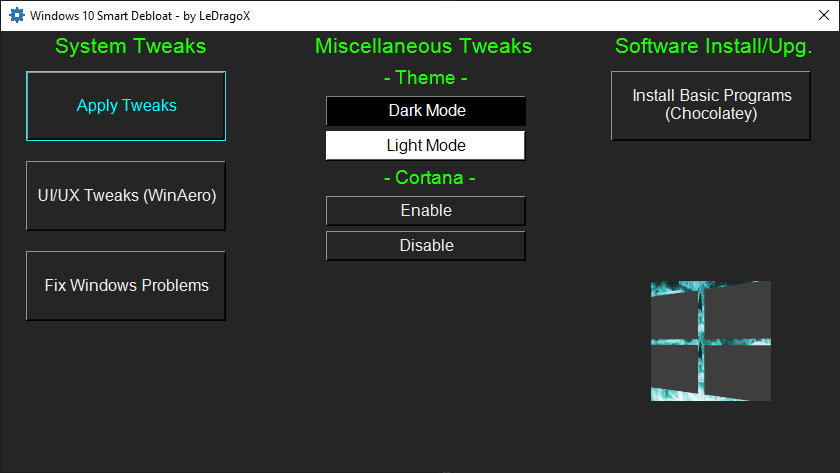
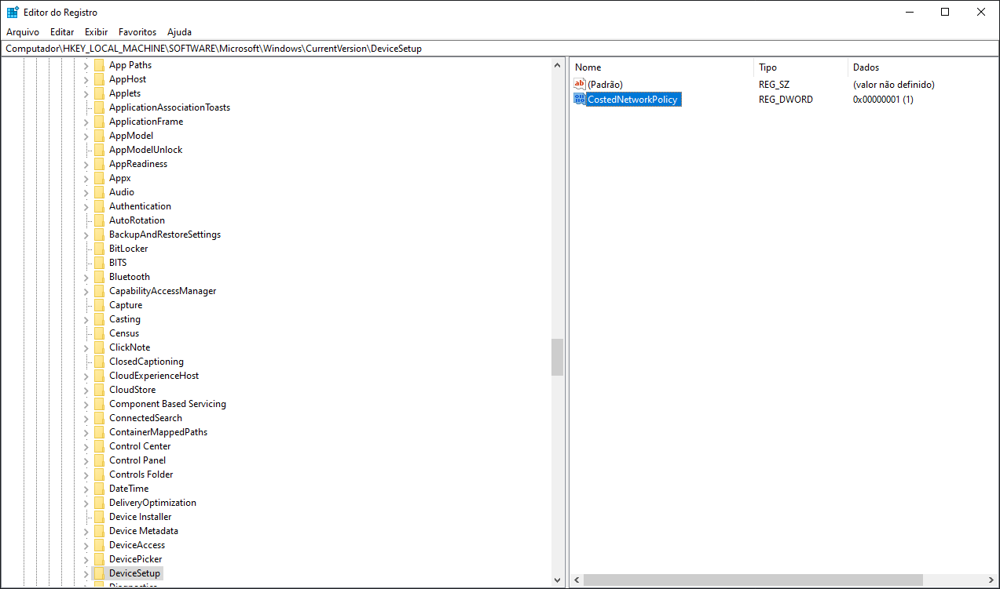

<h1>
     Win10 Smart Debloat 
    
</h1>

## Adapted from [W4RH4WK's Project](https://github.com/W4RH4WK/Debloat-Windows-10)

## Download Latest Version

Code located in the `master` branch is always considered under development,
but you'll probably want the most recent version anyway.

|    Download    | Should work on |   Build   |      Editions     | Script version |
|:--------------:|:--------------:|:---------:|:-----------------:|:--------------:|
| [Download [Zip]](https://github.com/LeDragoX/Win10SmartDebloat/archive/master.zip) | 21H1 and Older | 19043.xxxx |Home/Pro/Enterprise| **Always Latest** |

## Resume

This is an adapted version from [another project](https://github.com/W4RH4WK/Debloat-Windows-10). 
These scripts will Customize, Debloat and Improve Security/Performance on Windows 10.

## Roll-Back

**There is a undo (if works)**, because i did a restoration point script before
doing everything.

**Use on a fresh windows install to note the differences, and if something breaks,**
**you can rely on a pre-made restoration point and the** [`repair-windows.ps1`](./scripts/repair-windows.ps1) file.

## Usage Requirements

The `Script-Win10.ps1` do not make everything automatically, follow these steps.

- Open `OpenPowershellHere.cmd` (For beginners) or the Powershell as admin on its folder.
- Enable execution of PowerShell scripts and Unblock PowerShell scripts and modules within this directory.

### Easy way (Prepare and Run once):

#### GUI

- Copy and Paste this entire line below on **Powershell**:
```Powershell
Set-ExecutionPolicy Unrestricted -Scope CurrentUser -Force; ls -Recurse *.ps*1 | Unblock-File; .\"Win10ScriptGUI.ps1"
```

*The `Apply Tweaks` button is the main one.*

#### CLI (Advice - If you want FULL Output to be displayed on the console, use this version)

- Copy and Paste this entire line below on **Powershell**:
```Powershell
Set-ExecutionPolicy Unrestricted -Scope CurrentUser -Force; ls -Recurse *.ps*1 | Unblock-File; .\"Win10Script.ps1"
```

**[Scripts](/scripts) can be run individually, pick what you need.**

## GUI Script Features

- Run every 'non-interactive' Tweak scripts;
- Run WinAero Tweaker to apply my profile and other "Manual" softwares in the future (maybe); ([`manual-debloat-softwares.ps1`](./scripts/manual-debloat-softwares.ps1))
- [Optional] Try to Completely fix the Windows worst problems via Command Line; ([`backup-system.ps1`](./scripts/backup-system.ps1) and ([`repair-windows.ps1`](./scripts/repair-windows.ps1))
- Apply Dark Mode or Light Mode exclusively from GUI; ([Dark](./utils/dark-theme.reg) and [Light](./utils/light-theme.reg))
- Install Chocolatey and install Basic Softwares from my selection. ([`choco-sw-installer.ps1`](./scripts/choco-sw-installer.ps1) See Doc: [Chocolatey-SW-Installer.md](./lib/docs/Chocolatey-SW-Installer.md))

## Script Features

- Import all necessary Modules before Executing everything; ([lib folder](lib/))
- Make a Restore Point and Backup the Hosts file; ([`backup-system.ps1`](./scripts/backup-system.ps1))
- Download OOShutUp10 and import all Recommended settings; ([`silent-debloat-softwares.ps1`](./scripts/silent-debloat-softwares.ps1))
- Download AdwCleaner and Run the latest version of for Virus/Adware scan;
- Disable Telemetry from Scheduled Tasks and Optimize it; ([`optimize-scheduled-tasks.ps1`](./scripts/optimize-scheduled-tasks.ps1))
- Re-Enable useful Services & Disable the Heavy ones; ([`optimize-services.ps1`](./scripts/optimize-services.ps1))
- Remove Bloatware Apps that comes with Windows 10, except from my choice; ([`remove-bloatware-apps.ps1`](./scripts/remove-bloatware-apps.ps1))
- Optimize Privacy and Performance settings via Registry and Powershell commands; ([`optimize-privacy-and-performance.ps1`](./scripts/optimize-privacy-and-performance.ps1))
- Apply General Personalization tweaks via Registry and Powershell commands; ([`personal-optimizations.ps1`](./scripts/personal-optimizations.ps1))
- Help improve the Security of Windows by a little; ([`optimize-security.ps1`](./scripts/optimize-security.ps1))
- Enable Optional Features especially for Gaming/Work (including WSL 2); ([`enable-optional-features.ps1`](./scripts/enable-optional-features.ps1))
- Remove OneDrive completely from the System, re-install is possible via Win Store; ([`remove-onedrive.ps1`](./scripts/remove-onedrive.ps1))
- [Optional] Run WinAero Tweaker for Extra UI Customization and tell how to import my Profile; ([`manual-debloat-softwares.ps1`](./scripts/manual-debloat-softwares.ps1))
- [Optional] Try to Completely fix the Windows worst problems via Command Line; ([`repair-windows.ps1`](./scripts/repair-windows.ps1))
- In the End it Locks Script's Usage Permission. ([`Win10Script.ps1`](./Win10Script.ps1))

***Optional**: Means that you decide what to do.

## Known Issues 

1. Start menu Search (`WSearch` indexing service will be disabled)
2. Sysprep will hang (Not Tested)
3. [~Xbox Wireless Adapter~](https://github.com/W4RH4WK/Debloat-Windows-10/issues/78) (Fixed by not disabling the `XboxGipSvc` service)
4. [Issues with Skype](https://github.com/W4RH4WK/Debloat-Windows-10/issues/79) (`Microsoft.SkypeApp` app will be uninstalled)
5. [Fingerprint Reader / Facial Detection not Working](https://github.com/W4RH4WK/Debloat-Windows-10/issues/189) (`WbioSrvc` service will be disabled)
6. Bluestacks doesn't work with Hyper-V enabled

### Solution 1
```Powershell
Get-Service WSearch | Set-Service -StartupType Automatic -PassThru | Start-Service
```

### Solution 5
```Powershell
Get-Service WbioSrvc | Set-Service -StartupType Automatic -PassThru | Start-Service
```

### Solution 6
```Powershell
Dism -Online -Disable-Feature -NoRestart -FeatureName:"Microsoft-Hyper-V-All"
Dism -Online -Disable-Feature -NoRestart -FeatureName:"HypervisorPlatform"
Dism -Online -Disable-Feature -NoRestart -FeatureName:"VirtualMachinePlatform"
```

## Contribute

I would be happy to extend the collection of scripts. 
Just open an issue or send me a pull request. (Yes, if its useful, you can).

### Thanks To

- [W4RH4WK](https://github.com/W4RH4WK) (For his project ^^)
- [Sergey Tkachenko](https://winaero.com/) (*WinAero Tweaker Dev.*)
- [O&O Software GmbH](https://www.oo-software.com/en/company) (*ShutUp10 Dev. Company*)
- [MalwareBytes](https://br.malwarebytes.com/company/) (*AdwCleaner Dev. Company*)

### Who inspired me to improve more:

- Special thanks to the [LowSpecGamer](https://youtu.be/IU5F01oOzQQ?t=324), he is the reason i've updated this script.

- [Adamx's channel](https://www.youtube.com/channel/UCjidjWX76LR1g5yx18NSrLA) - by [this video](https://youtu.be/hQSkPmZRCjc) 
- [Baboo's channel](https://www.youtube.com/user/baboo) - by [this video](https://youtu.be/qWESrvP_uU8)
- [ChrisTitusTech](https://www.youtube.com/channel/UCg6gPGh8HU2U01vaFCAsvmQ) - gave me more confidence to mess with PowerShell after [this video](https://youtu.be/ER27pGt5wH0)
- [Daniel Persson](https://www.youtube.com/channel/UCnG-TN23lswO6QbvWhMtxpA) - by [this video](https://youtu.be/EfrT_Bvgles)
- [matthewjberger](https://gist.github.com/matthewjberger) - by [this script](https://gist.github.com/matthewjberger/2f4295887d6cb5738fa34e597f457b7f)

## More Debloat Scripts (Community)

The scripts are designed to run With/Without (GUI/CLI) any user interaction. Modify them
beforehand. If you want a more interactive approach check out:

### Powershell (Sorted by complexity - Less to More)
- [windows-debloat](https://github.com/kalaspuffar/windows-debloat) from [kalaspuffar](https://github.com/kalaspuffar);
- [Windows10Debloater](https://github.com/Sycnex/Windows10Debloater) from [Sycnex](https://github.com/Sycnex) (Recommended);
- [win10script](https://github.com/ChrisTitusTech/win10script) from [ChrisTitusTech](https://github.com/ChrisTitusTech) (Recommended);
- [Windows 10 Sophia Script](https://github.com/farag2/Windows-10-Sophia-Script) from [farag2](https://github.com/farag2).

### Python
- [DisableWinTracking](https://github.com/10se1ucgo/DisableWinTracking) from [10se1ucgo](https://github.com/10se1ucgo).

## How did i find specific Tweaks?
<details>
    <summary>How To (Advanced Users)</summary>

By using [SysInternal Suite](https://docs.microsoft.com/pt-br/sysinternals/downloads/sysinternals-suite) `Procmon(64).exe`
i could track the `SystemSettings.exe` by filtering it per Process Name, then `Clearing the list (Ctrl + X)`
(But make sure it is `Capturing the Events (Ctrl + E)`) and finally, applying an option of the Windows Configurations
and searching the Registry Key inside `Procmon(64).exe`.


After finding the right register Key, you just need to Right-Click and select `Jump To... (Ctrl + J)` to get on its directory.



</details>

## License

Check the License file [here](LICENSE).